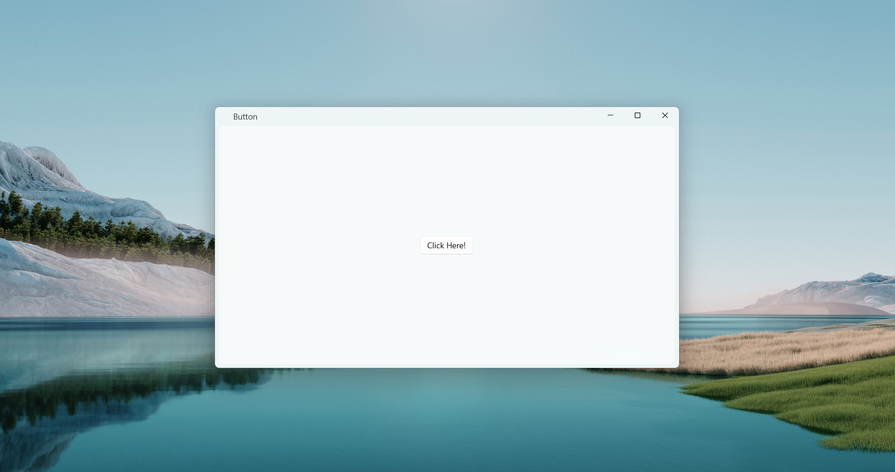
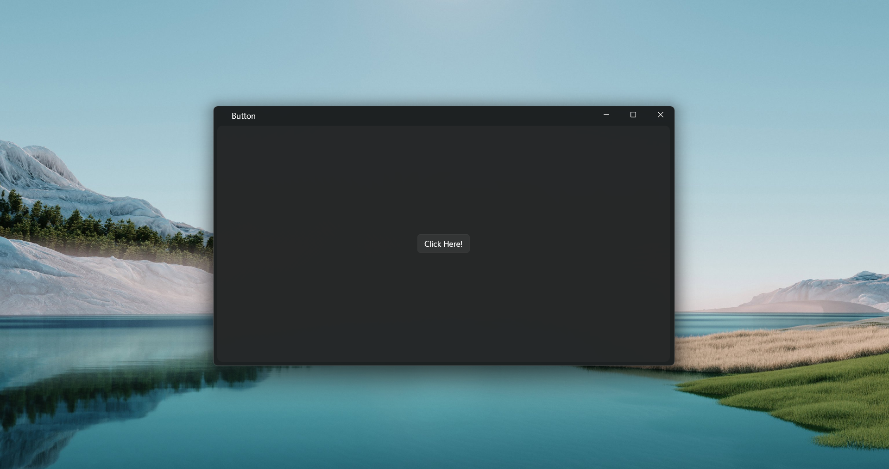

# Xaml-Island-WPF

Xaml-Island-WPF is an experimental repository demonstrating the use of XAML Islands inside a WPF application. XAML Islands allow modern WinUI XAML controls to be hosted in classic desktop applications (WPF, WinForms) to take advantage of newer UI controls.

This project is intended as a proof-of-concept and learning resource rather than a production-ready template.

## Features

- Host WinUI XAML controls inside a WPF application using XAML Islands
- Simple setup to explore interoperability between WPF and WinUI

## Prerequisites

- Windows 11 26100
- .NET SDK 10 

## Building and running

1. Clone the repository:

   ```sh
   git clone https://github.com/ahmadsafi24/Xaml-Island-WPF.git
   cd Xaml-Island-WPF
   ```

2. Open the solution or project in Visual Studio (`.sln` or the WPF project file).

3. Restore NuGet packages and build the solution.

4. Set the WPF project as the startup project and run (F5).

## Contributing

Contributions are welcome.

1. Fork the repository
2. Create a feature branch (`git checkout -b feature/my-change`)
3. Commit your changes and push the branch
4. Open a pull request describing the change

## Preview




